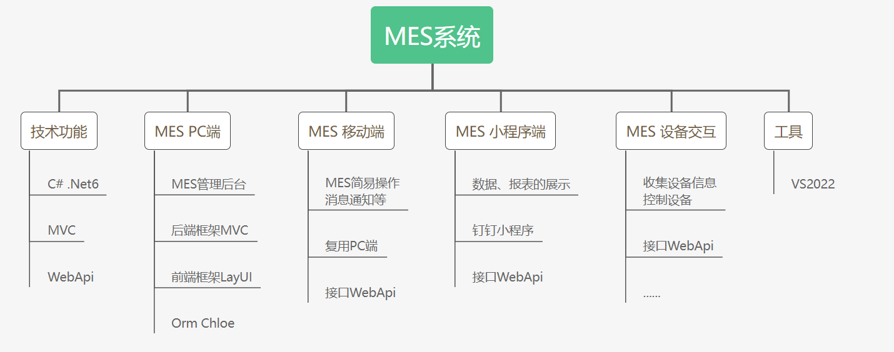
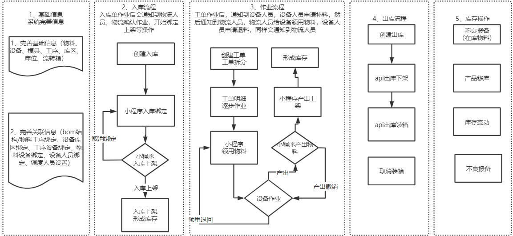
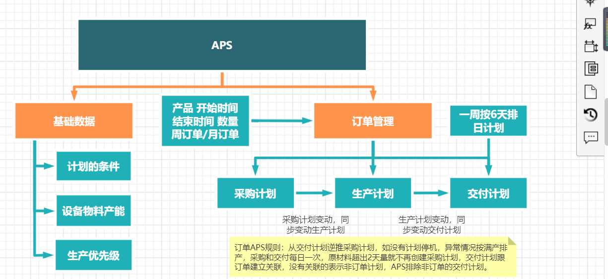

----
# EasyMES 

#### 简介
- 请勿用于违反我国法律的web平台、如诈骗等非法平台网站。
- 不包含任何采集程序及接口，使用场景为零部件离散型生产
- 此产品为商业授权，如需授权，请联系作者295228902
- 集成钉钉，才能完成钉钉消息推送，请知悉

#### 框架说明

#### 整体流程

#### 生产流程

#### APS

#### 捐赠支持

开源项目不易，若此项目能得到你的青睐，可以捐赠支持作者持续开发与维护，感谢所有支持开源的朋友。

          