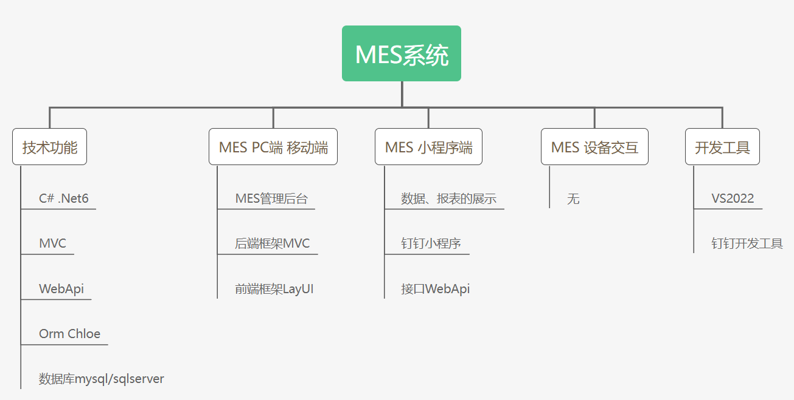

----
# EasyMES 

#### 简介
- 请勿用于违反我国法律的web平台、如诈骗等非法平台网站。
- 不包含任何采集程序及接口，使用场景为零部件离散型生产
- 集成钉钉，才能完成钉钉消息推送，请知悉
- 讨论交流QQ群（1065447456）
- 数据库目前有Mysql的脚本，可以转其他的
- 由于历史原因，业务复杂，暂不修改ORM及升级底层版本
- 此产品为商业授权，授权、服务联系作者，作者QQ295228902

#### 框架说明

#### 整体流程

#### 生产流程

#### APS

#### 部署方式
- Web项目和API项目一起部署，不同端口
- Web里设置API地址的跨域
- 设置主程序地址为Web的地址
- 钉钉程序内部设置Api地址，和Web服务器存放的图片地址

#### 捐赠支持

开源项目不易，若此项目能得到你的青睐，可以捐赠支持作者持续开发与维护，感谢所有支持开源的朋友。

          